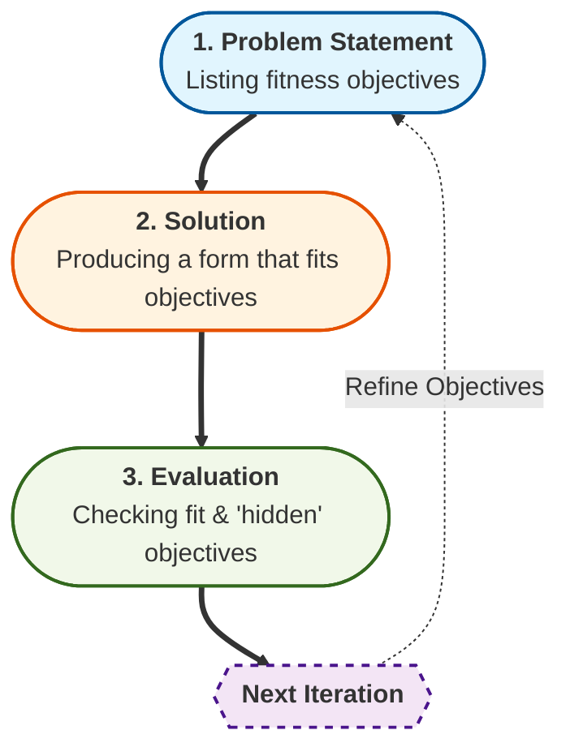

# Software Design 
## What
Please, read this document to the end if you want to learn what software design is. This folder contains some of my favorite design patterns, architecture styles, and software design techniques. (Work in Progress).
## Why
Software design is the most engineering and artistic part of software development. This is part of software development that is not as strict as "Computer Science", in the sense that there is no objective solution. Before diving into software design, we should define some of the important terms used in the language of software design and why this process tends to be subjective.

### Crux of the Design Problems
If you ask what the optimal algorithm is for searching for an element in a sorted list, the answer is binary search. This problem has an optimal algorithm. We discovered this algorithm, the problem is solved, and we move on. This is a type of problem that has a **well-defined** problem statement. Having a well-defined objective guides us in our search for an algorithm that solves it in an optimal way. Sometimes, you can have a well-defined objective, but the search space is so big that you may not have simple and easy solutions, or they can not be practically solved in a reasonable time. We call such problems **intractable**. Great example of such problem is a [busy beaver](https://en.wikipedia.org/wiki/Busy_beaver). However, these problems have well-defined objective and when you see a solution, you can recognize that you do not need to search further. What if you meet problem where defining the problem statement is is part of the problem itself?

**Design Problems** - type of problems, where you have to juggle both objectives and solutions. For example, think about coming up with a form for a cup. Your solution will change based on how you understand the problem. That is why you have cups of so many different forms. At the high level, you can think of cups, for example, as "an object formed to hold liquids". Let's start defining our objective function. Well, you want it to be "easy to grasp", "hold enough liquid, fora few sips, but not too much to become a bowl", so what else? Turns out, you can come up with an infinite list of requirements for a cup that can be sorted by relevance, but still. One of the requirements, unironically, will be "Do not blow up the Moon, during the process of making a cup". Point is, list of requirements is, indeed, infinite. You can not come up with shortlist, but not all requirements have same weight, as some are hihgly unlikely to occur or matter. This may sound strange, but how to sort an infinite list of requirements based on relevance? How to evaluate relevance in the first place?

Second issue, even if you come up with a shortlist of relevant requirements, finding a solution can pose a problem as well, as you may not immediately recognize that some objectives you put forward may be in direct contradiction to each other. We call such problems **ill-defined**. Many design problems are, in fact, ill-defined. And you may end up discovering this only when you start solving the problem.

We figured out how to find solutions to such problems effectively. I would not have written so much text if we did not have. But, this comes with accepting that there is no termination condition for design problems - they are, by nature, **open ended** problems. 

**Design Process** - an effective way of solving design problems. Unfortunately, design problems turn them are by nature intractable problems, but aside from some forms of intractable problems, you can make progress in solving the problem by gradually converging on both the solution and the problem statement. The design process has a **design iteration**:

Point is, your starting list of requirements do not really matter that much. You can start with arbitrary list and converge to somewhat right list of requirements and somewhat right form. However, better your starting point is, fewer steps it takes to converge.

The best book that recognizes this process comes from [Christopher Alexander's](https://en.wikipedia.org/wiki/Christopher_Alexander) [Notes on the Syntesis of Form](https://en.wikipedia.org/wiki/Notes_on_the_Synthesis_of_Form).

### Software Design
Now, we have to turn back into software engineering, and problems for software design. Software, as compared to hardware, has different types of design problems associated. The biggest merit of software is that it is "modular" and has **Ease of Change**. You can, in fact, measure the quality of software on this - **Cost of Change** (in the sense of satisfying "new" requirements). **Cost of Maintenance** is a related concept - cost of change to preserve the software and to maintain its usability without adding new features. Some software changes are trivial and tractable, as mentioned above, and have rather straightforward solutions. Such changes are not design problems.

However, sometimes, we meet a type of problem, for example, that can come in the form of a new requirement where you can recognize that if done naively, it will turn your software into an unmaintainable mess - that is, a change that is hard to rework or maintain later. Anything that stifles the ease of change of a software strips the software of its main merit. At the end of the day, why make life harder by solving a hardware problem with software? If you can easily make it part of the hardware itself? If you can guarantee that you do not need a rework, that is. You merit a little from a cup that can programmatically change its form, right? We know for a fact that if we have a software problem, then by its nature, it is meant to be changed. 

So, if we have a problem that is not trivial, then what are the objectives? Ease of change, but this is still too vague and general to be actionable. Similar to many of the design problems, you can come up with an endless list of requirements.

**Software Design** - A type of software development problems that juggle ease of change of a sofware with a solution to satisfy requirements.

What makes software easy to change? Lines of code (LOC)? Well, if you have 1000 lines of somewhat repetitive code, this does not make it harder to maintain or change. Even if it is 1000,000 lines, you could imagine writing a simple script to add new stuff, or ask your LLM to do this for you, or even better - rewrite it with fewer lines.

**Software Complexity** is the main culprit that makes software hard to change. Some complex (new) requirements require complex reworks. There are two types of complexity for the software:

* **Essential Complexity** - Some complex software exists because the problems we want to solve with it are as complex. This can not be reduced.

* **Accidental Complexity** - We may misunderstand requirements or make shortcuts. Why spend 5 hours to find the best algorithm that solves this particular problem, that may be 10 lines of code, if you can write 100 lines in 10 minutes that does marginally worse? "Best" is the enemy of "better". This is a practical tradeoff. We use this reasoning, modify existing code by adding a bit more, and see our codebase rot. This is how all of the accidental complexity is incurred.

### Software Architecture
As the complexity of the software grows, we end up with some problems that are really massive. Problems that are at a systems level and require rework of 1000's of LOC in multiple files under multiple directories in your codebase, that can span across multiple services and devices in a distributed network. Architecture problems are indeed design problems on a bigger scale. And in such scales, they have different things that are relevant to them and end up having a different set of objectives. You can think of architecture and design problems as being on a spectrum of complexity, where less complex problems are design problems and more complex problems are architecture problems.

Architecture problems are like the general theory of relativity to gravity, while design problems are like Newtonian gravity. In the vicinity of Earth, Newtonian dynamics is simpler to apply, even if it is less accurate than general relativity. It gets the job done. But closer to the earth, there are ups and downs. Similarly, design problems have somewhat well-scoped objectives. If you require rigor at scale, Newtonian gravity does not cut it; the same goes with Architecture problems for design problems at a larger scale. There are two laws of software architecture that you should know:

1. In software architecture, **everything is a tradeoff**. This means you can not really discuss "better" or "worse". "Good software" or "Bad software". Such will not cut it. Remember, "In space, there is no up and down." Similarly, in software architecture, there is no good or bad architecture. Any solutions have merits and demerits. Balancing them with the requirements of the software is what matters. No silver bullets - you can not use microservices for every system. You can not use pub/subs for every communication. The issue here is not that it will not work, as indeed you can fit either pub/sub or microservices to any software. The issue here is an opportunity costs of not using something that balances the tradeoff of merits to demerits with cost of change to user requirements.

2. **WHY is more important than HOW.** The primary objective of a software architect is, in the end, to convince the team of developers to take his words seriously and implement the architecture as the architect imagined. People do not want to do what they do not understand or do not buy into. Simple as that. Architects can not solve these problems alone; otherwise, it would not have been architecture problem to begin with! And because everything is a tradeoff, any developer can argue that they can come up with a better solution! "My solution is the best." "No! My solution is better than yours!" Nobody wants to be in shouting matches like this, fueled by ego. Instead, you should just be honest and acknowledge demerits, and provide reasons why accepting those demerits is okay. "I think we should implement microservices, because this is how you implement it" is not convincing. "I think we should implement microservices, because we are planning to expand our services in several ways in the future, and although it is more complex, it has higher deployment and development overhead, we will be able to spin up new servers on demand and better satisfy our customer needs". This is tangible, you can argue with it by providing data, and developers can get communicated on what is important for the project. Software Architects job is to ensure that individual contributors (IC's) can have well scoped smaller design problems that they can execute independently, while maintaining holistic vision of the entire system.

## How
Let's be pragmatic. You do not need to reinvent the wheel and start from a white canvas. Some common problems have common solutions. You do not need to come up with a new form for a cup. You can just adopt one of the existing solutions. Design problems have such solutions - **Design patterns**. Architecture problems, similarly, have such a solution - **Architecture Styles**. Design pattern tend to be more practical and easy to apply, but Architecture styles can only specify their merits and demerits.

### Resources

**Online Resources**
- WIP
**Books**
- WIP
